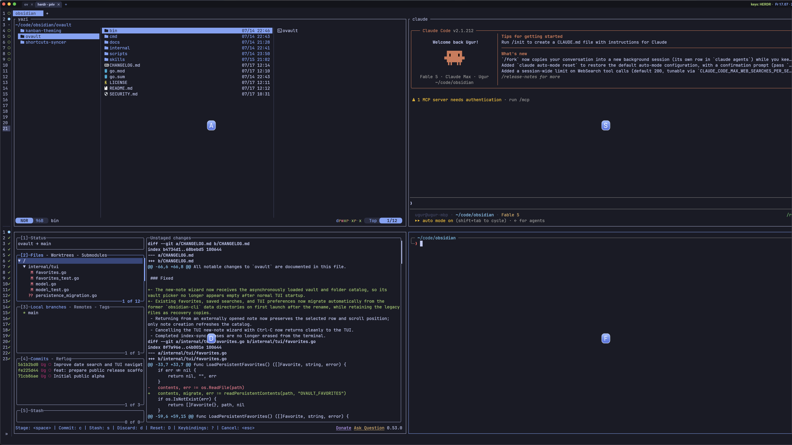

# Herdr Pane Picker

Focus a Herdr pane by typing the character shown directly over it.



Hints use a home-row-first alphabet: `a`, `s`, `d`, `f`, then the remaining
letters. They follow the visual pane order from top to bottom and left to right.
The picker does not write into pane PTYs or disturb the programs running inside
them.

The screenshot shows the picker over a live four-pane workspace (yazi, Claude
Code, lazygit, shell). For captures without personal content, a fictional demo
layout ships in `scripts/` — see Documentation screenshots below.

## Requirements

- macOS
- Herdr 0.7.4 or newer
- Python 3.9 or newer
- A Kitty-graphics-compatible outer terminal
- Herdr's experimental Kitty graphics support enabled

The optional popup-free integration additionally requires WezTerm 20230320 or
newer. The shipped PNG badges have no runtime Python dependencies. Pillow is
only needed to rebuild them.

## Install

Enable graphics in the existing `[experimental]` section of
`~/.config/herdr/config.toml`:

```toml
[experimental]
kitty_graphics = true
```

Do not add a second `[experimental]` table if one already exists. Install the
reviewed release:

```sh
herdr plugin install ugurtarlig/herdr-pane-picker --ref v0.1.1
```

If Kitty graphics was enabled after the current Herdr client started, detach
and relaunch that client once so it can report terminal pixel geometry.

## Portable picker

Try the portable action immediately:

```sh
herdr plugin action invoke ugurtarlig.pane-picker.open
```

This opens a small session-modal prompt, draws the hints over the existing
panes, and captures the selection inside Herdr. Bind it in
`~/.config/herdr/config.toml`:

```toml
[[keys.command]]
key = "prefix+alt+p"
type = "plugin_action"
command = "ugurtarlig.pane-picker.open"
description = "pick a pane by character hint"
```

Reload the configuration:

```sh
herdr server reload-config
```

## Popup-free WezTerm integration

The fast path draws only the character badges. Herdr starts the overlay while
WezTerm captures the next key in a one-shot key table.

First bind the overlay action in Herdr:

```toml
[[keys.command]]
key = "cmd+shift+p"
type = "plugin_action"
command = "ugurtarlig.pane-picker.show"
description = "pick a pane by character hint"
```

Then load this repository as a WezTerm plugin near the end of your
`wezterm.lua`, before returning `config`:

```lua
local pane_picker = wezterm.plugin.require(
  "https://github.com/ugurtarlig/herdr-pane-picker"
)

pane_picker.apply_to_config(config, {
  key = "p",
  mods = "CMD|SHIFT",
  is_herdr = function(_, pane)
    return pane:get_title():lower():find("herdr", 1, true) ~= nil
  end,
})
```

`is_herdr` decides whether `Cmd+Shift+P` targets Herdr. Replace the example
with your own reliable routing predicate if your Herdr pane titles do not
contain `herdr`. Outside Herdr, the integration keeps WezTerm's native
`PaneSelect` behavior. Inside Herdr it forwards the enhanced key sequence,
activates the one-shot `a/s/d/f` table, and runs the plugin's selection helper.

WezTerm caches Git plugins. After upgrading this plugin, run
`wezterm.plugin.update_all()` from WezTerm's debug overlay to update the outer
integration as well.

## Controls

- Type the visible letter to focus that pane.
- Press Escape or Ctrl-G to cancel.
- Hints clear automatically after six seconds.

## How it works

The helper reads the current `pane.layout`, loads pre-rendered PNG badges, and
sends the small `pane.graphics.set` requests sequentially. Sequential local
socket updates are substantially faster than simultaneous connections to
Herdr's render loop.

The popup-free mode stores a short-lived hint-to-pane mapping in the local
state directory. The WezTerm one-shot action starts a small selection helper,
which calls `pane.focus`, clears every badge, and removes the state. No pane
content or keypress is sent over the network.

If the active client cannot render Kitty graphics, the request fails without
touching pane content. Errors are appended to
`~/.config/herdr/plugin-state/ugurtarlig.pane-picker/errors.log`.

## Local development

```sh
git clone https://github.com/ugurtarlig/herdr-pane-picker.git
cd herdr-pane-picker
./activate-local.sh
python3 -m unittest discover -s tests -v
```

To rebuild the badge assets:

```sh
python3 -m pip install Pillow
python3 pane_picker.py build-assets
```

### Documentation screenshots

Capture screenshots only from an isolated session so no personal tabs or pane
content appear. The demo creates its own `pane-picker-demo` tab and never
replaces an existing layout; it refuses to run against the default session.

```sh
herdr --session pane-picker-demo          # in a fresh terminal window
HERDR_SESSION=pane-picker-demo python3 scripts/demo_layout.py
HERDR_SESSION=pane-picker-demo python3 pane_picker.py show
```

Any keypress inside a demo pane closes it. Remove the whole demo tab with:

```sh
HERDR_SESSION=pane-picker-demo python3 scripts/demo_layout.py --close
```

## Uninstall

```sh
herdr plugin uninstall ugurtarlig.pane-picker
```

Remove the matching `[[keys.command]]` block from the Herdr configuration. If
you enabled the WezTerm integration, remove its `plugin.require` and
`apply_to_config` calls as well.

## Marketplace

Herdr automatically indexes public GitHub repositories carrying the
`herdr-plugin` topic. See the official [plugin documentation][plugins] and
[marketplace guide][marketplace].

## License

MIT

[plugins]: https://herdr.dev/docs/plugins/
[marketplace]: https://herdr.dev/docs/marketplace/
